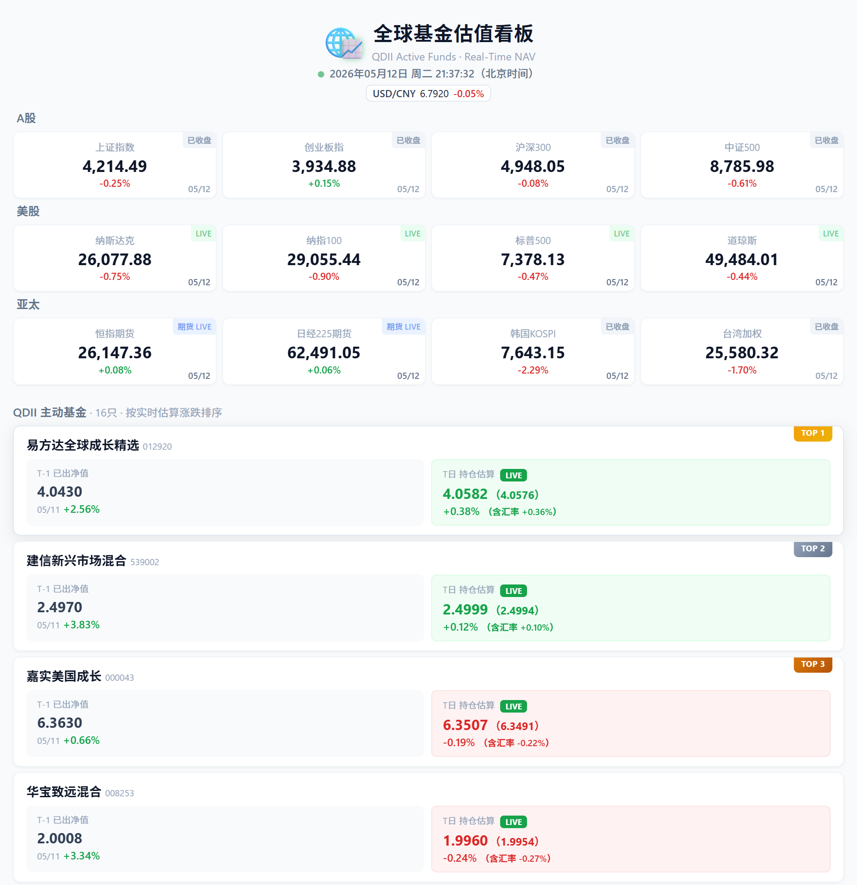

# 全球基金估值看板

实时追踪 QDII 主动基金净值 —— 基于持仓股的实时行情，计算 T 日估算净值，解决 QDII 基金净值 T+2 披露的滞后问题。

## 特性

- **12 个全球指数**：A 股（上证、创业板、沪深300、中证500）、美股（纳斯达克、纳指100、标普500、道琼斯）、亚太（恒生指数、日经225、韩国KOSPI、台湾加权）
- **期货参考**：纳指100、标普500、道琼斯、恒生指数、日经225 在现货闭市且对应期货活跃时，自动显示对应期货并标注“期货 LIVE”
- **16 只 QDII 主动基金**：覆盖纳斯达克精选、全球科技、全球成长、新兴市场等品类
- **双净值展示**：每只基金同时展示 T-1 官方已出净值（含日间涨跌幅）和 T 日实时估算净值
- **持仓穿透**：点击基金卡片展开前十大持仓明细，实时现价、涨跌幅、权重贡献度一目了然
- **市场状态标签**：各市场指数与持仓股实时标注 LIVE / 延迟 / 已收盘 交易状态，LIVE 标签带呼吸脉冲动画
- **实时排序**：按估算涨跌幅排序，涨幅 TOP 3 带有金/银/铜专属标签
- **多市场行情**：覆盖 A 股、港股、美股、日韩台等市场的指数与个股实时行情

## 技术栈

| 层面 | 技术 |
|------|------|
| 框架 | React 18 + TypeScript |
| 构建 | Vite 5 |
| 样式 | CSS Modules |
| 数据源 | 新浪财经（实时行情）+ 东方财富/天天基金（基金净值） |
| 架构 | 纯前端 + Vite 服务端代理（解决跨域） |

## 数据流

```
浏览器 ──→ Vite Dev Server（代理）
              ├── /api/sina        ──→ 新浪财经（行情）
              ├── /api/fundnav     ──→ 天天基金（净值估算）
              └── /api/fundhistory ──→ 东方财富（历史净值）
```

基金 T 日实时估算净值的计算方式：

```
估算净值 = T-1 官方净值 × (1 + Σ(持仓股权重 × 持仓股实时涨跌幅))
```

## 项目结构

```
fund_valuation/
├── index.html
├── package.json
├── vite.config.ts                 # Vite 配置
├── vite-sina-proxy.ts             # 服务端数据代理（三合一）
├── tsconfig.json
└── src/
    ├── types.ts                   # 类型定义
    ├── constants.ts               # 指数配置 + 16只基金持仓
    ├── api.ts                     # 数据获取 & 多市场解析
    ├── hooks/
    │   └── useQuotes.ts           # 行情 + 净值 + 估算 hook
    ├── components/
    │   ├── Header.tsx             # 标题栏（实时时钟）
    │   ├── IndexCards.tsx         # 12 个指数卡片面板
    │   ├── FundCard.tsx           # 基金卡片（双净值 + 展开）
    │   └── HoldingsTable.tsx      # 持仓明细表
    ├── marketHours.ts             # 各市场交易时段（北京时间）
    ├── App.tsx                    # 主应用（排序逻辑）
    ├── App.module.css
    ├── index.css
    └── main.tsx
```

## 快速开始

```bash
# 1. 克隆项目
git clone <repo-url>
cd fund_valuation

# 2. 安装依赖
npm install

# 3. 启动开发服务器
npm run dev

# 4. 浏览器打开
open http://localhost:5173
```

## 构建部署

```bash
npm run build     # 产物输出到 dist/
npm run preview   # 预览生产构建
```

> 生产部署时，需要配置反向代理将 `/api/sina`、`/api/fundnav`、`/api/fundhistory` 转发至对应上游。可参考 `vite-sina-proxy.ts` 中的代理逻辑。

## 演示

### 概览




## 数据说明

- **实时行情**：来自新浪财经，A 股为交易时段实时，美股为北京时间晚间实时。港股和亚太指数非交易时段显示前收盘价；纳指100、标普500、道琼斯、恒生指数和日经225在现货闭市时可显示对应期货参考行情
- **市场状态**：各市场根据交易所本地时区、周末和 2026 年主要休市日判定 LIVE / 延迟 / 已收盘
- **T-1 官方净值**：来自天天基金/东方财富，为最近一个已公布的基金净值（通常为前一个美股交易日）
- **T-1 净值涨跌幅**：来自东方财富历史净值数据，为官方净值相较前一天的日间涨跌
- **T 日实时估算**：基于基金前十大持仓的实时行情加权计算，仅供参考，不代表基金实际净值。实际净值以基金公司披露为准
- **持仓数据**：基于基金最新季报/年报披露的前十大持仓，权重为近似值，可能因基金经理调仓而与实际有偏差

## License

MIT
