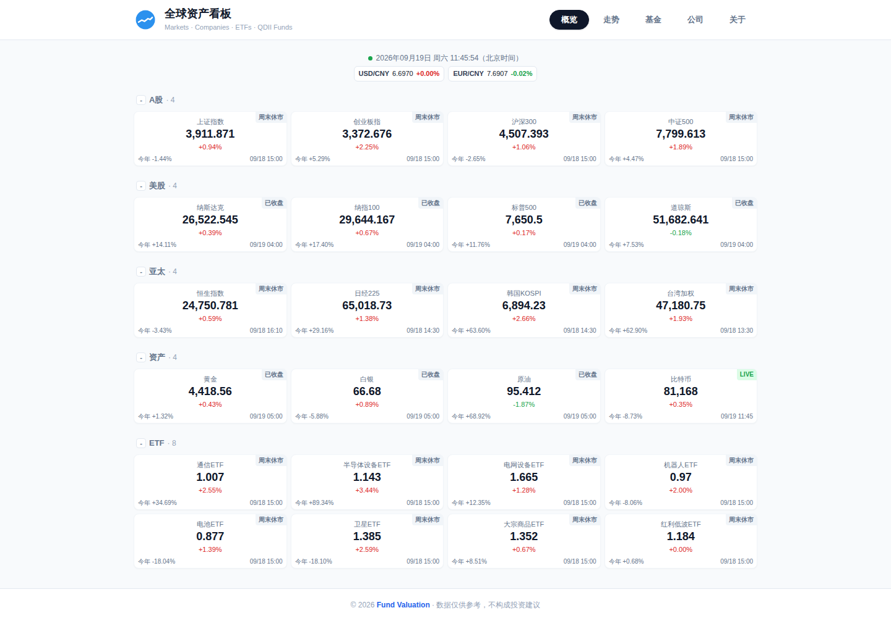
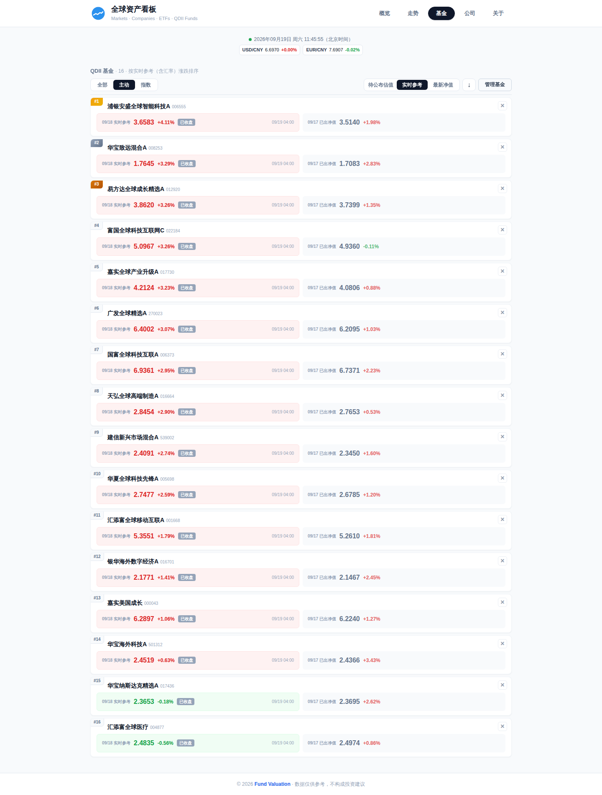
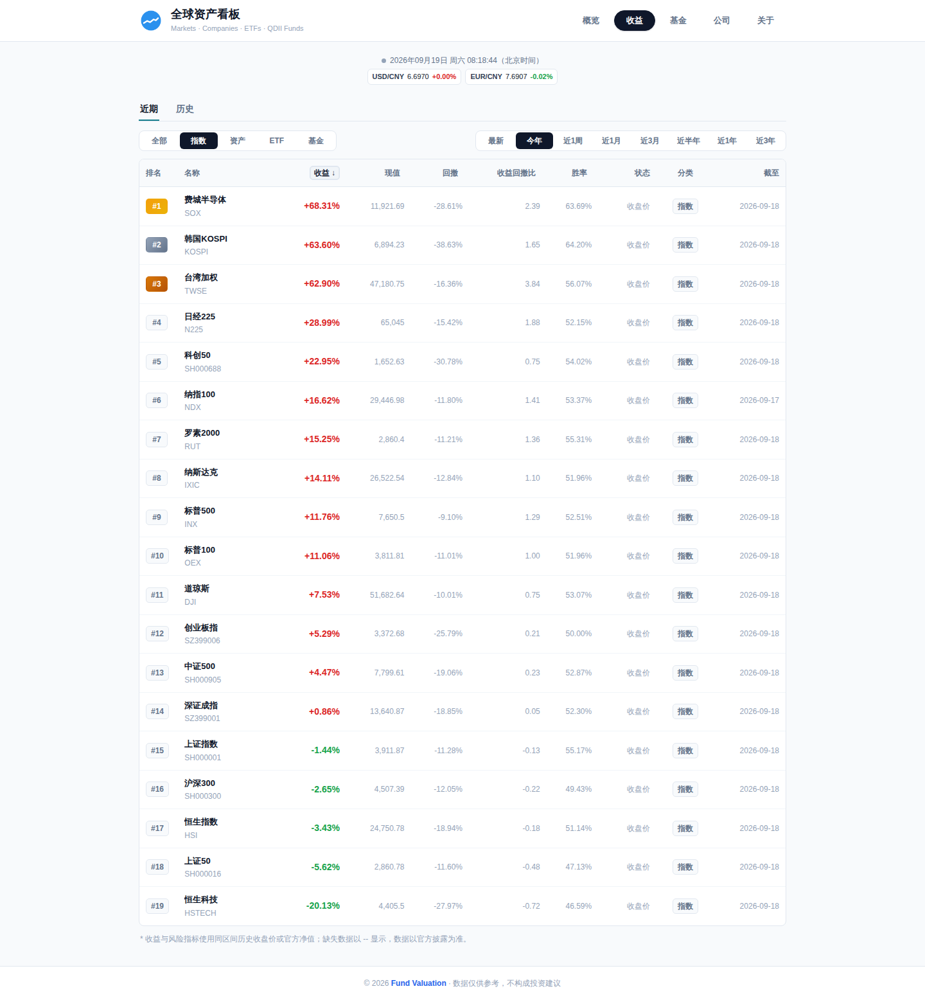
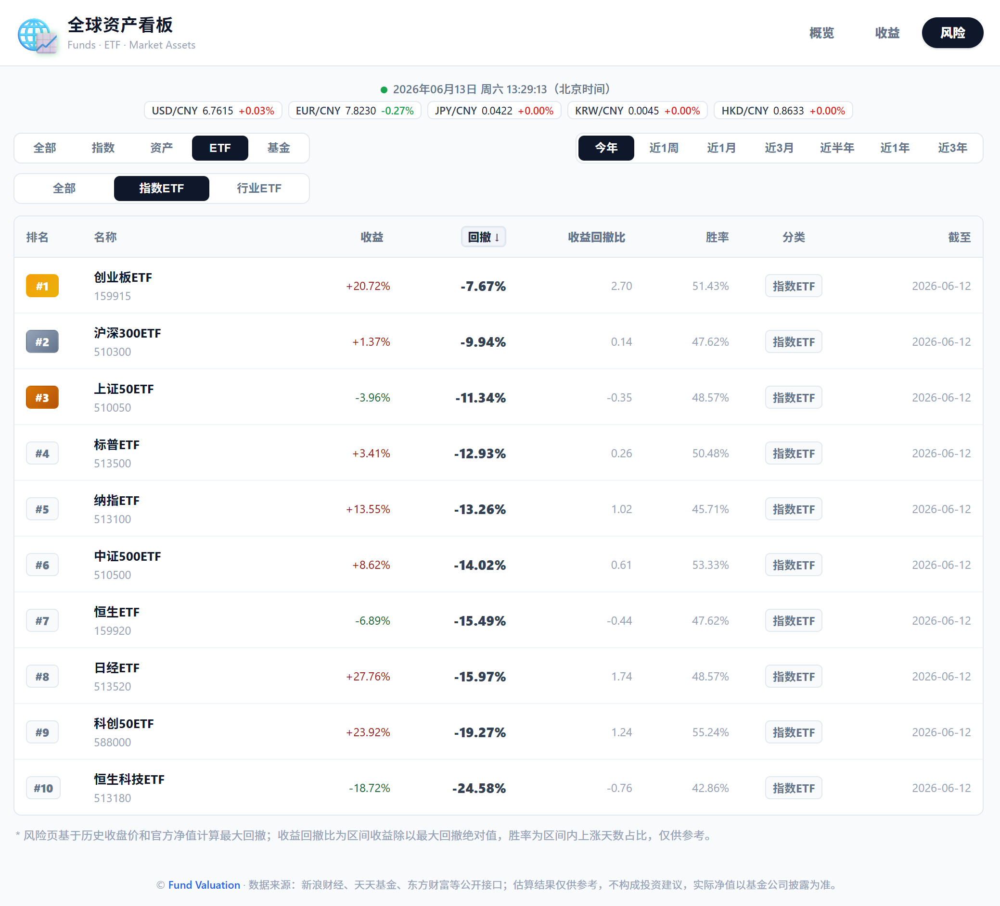
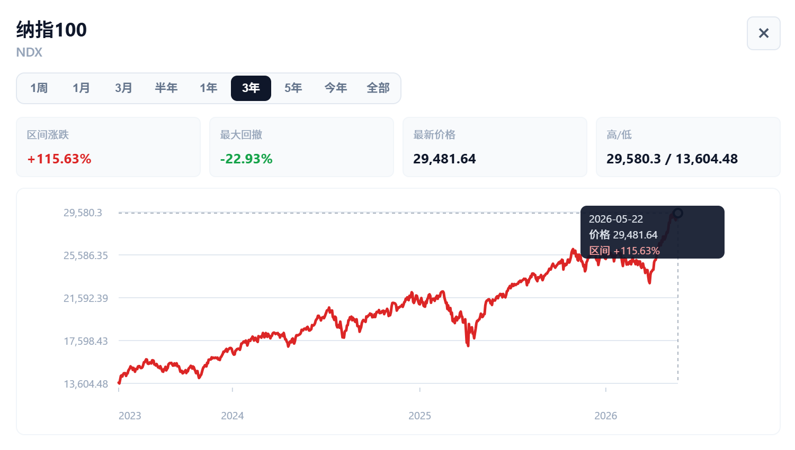
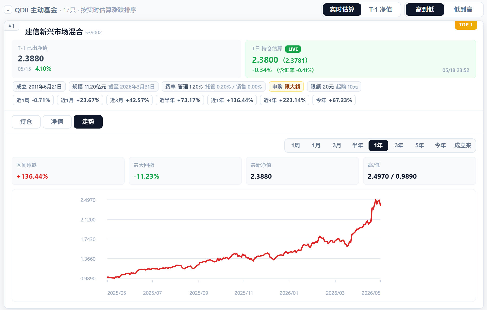
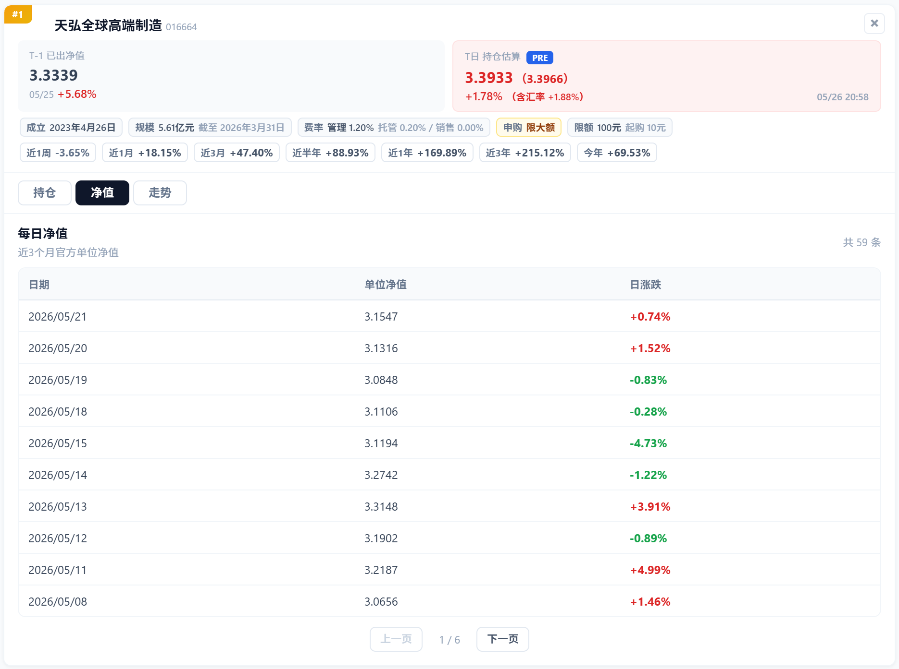

# 全球资产看板

追踪全球指数、资产、ETF 与 QDII 主动基金，覆盖实时概览、区间收益、回撤风险和基金 T 日估算净值。

## 特性

- **12 个全球指数**：A 股（上证、创业板、沪深300、中证500）、美股（纳斯达克、纳指100、标普500、道琼斯）、亚太（恒生指数、日经225、韩国KOSPI、台湾加权）
- **资产参考**：独立展示黄金、白银、原油和比特币行情，用于辅助观察风险偏好、通胀和流动性环境
- **期货参考**：纳指100、标普500、道琼斯、恒生指数、日经225 在现货闭市且对应期货活跃时，自动显示对应期货并标注“期货 LIVE”
- **市场历史走势**：点击支持的指数/资产卡片查看历史行情，支持今年、1周、1月、3月、半年、1年、3年、5年和全部区间
- **基金管理**：默认 17 只 QDII 主动基金，支持本地添加/删除基金和一键恢复默认列表
- **双净值展示**：每只基金同时展示 T-1 官方已出净值（含日间涨跌幅）和 T 日实时估算净值
- **持仓穿透**：点击基金卡片展开前十大持仓明细，实时现价、涨跌幅、权重贡献度一目了然
- **动态持仓估算**：新增基金会从东方财富/天天基金抓取最新披露持仓，保存到 SQLite，并在可映射行情时自动参与估算
- **每日净值表**：展开基金卡片可查看近 3 个月每日官方净值和涨跌幅，支持分页浏览
- **历史净值走势**：展开基金卡片可切换查看官方历史单位净值，支持 1周、1月、3月、半年、1年、3年、5年和成立来区间
- **市场状态标签**：各市场指数与持仓股实时标注 LIVE / 延迟 / 已收盘 交易状态，LIVE 标签带呼吸脉冲动画
- **实时排序**：按估算涨跌幅排序，涨幅 TOP 3 带有金/银/铜专属标签
- **多市场行情**：覆盖 A 股、港股、美股、日韩台等市场的指数、个股与资产参考行情

## 技术栈

| 层面 | 技术 |
|------|------|
| 框架 | React 18 + TypeScript |
| 构建 | Vite 6 |
| 样式 | CSS Modules |
| 数据源 | 新浪财经（实时行情/历史行情）+ 东方财富/天天基金（基金净值） |
| 后端 | Flask + SQLite |
| 架构 | React 前端 + Python 本地数据后端（抓取、缓存、持久化） |

## 数据流

```
浏览器 ──→ Vite Dev Server ──→ Python 后端
                                ├── /api/sina           ──→ 新浪财经（指数/股票/资产行情）
                                ├── /api/fundnav        ──→ 天天基金（净值估算）
                                ├── /api/fundhistory    ──→ 东方财富（历史净值）
                                ├── /api/fundholdings   ──→ 东方财富/天天基金（基金持仓）
                                ├── /api/fundbacktest   ──→ SQLite（估值回测与拟合误差）
                                ├── /api/marketreturns  ──→ SQLite（指数/资产区间收益）
                                └── /api/markethistory  ──→ 新浪财经（指数/资产历史行情）

Flask 后端会把上游原始响应保存到 `data/raw/`，并把基金历史净值、基金持仓、持仓股票日 K、指数/资产日 K 和估值回测结果写入 `data/fund_valuation.db`。
历史接口默认优先读取 SQLite；当已有缓存明显早于当前日期且最近 30 分钟未检查过上游时，会做一次小范围增量刷新后返回，避免历史走势长期停留在旧交易日。
独立刷新 worker 会定时预热历史数据、基金净值和估值回测，并按现货 1 分钟、期货 2 分钟、加密资产 5 分钟、闭市 15 分钟的节奏保存结构化行情快照。快照默认保留 30 天，用于数据时效诊断和异常回放。
```

基金 T 日实时估算净值的计算方式：

```
# 单只持仓的 RMB 涨跌（外币持仓并入对应兑 CNY 汇率涨跌）
rmbChange = ((1 + 股票涨跌幅) × (1 + 汇率涨跌幅) - 1)

# 加权涨跌：仅累加有实时行情的持仓
加权涨跌 = Σ(持仓权重 × rmbChange)

# 覆盖率归一化：把已覆盖部分投影到全基金，作为展示口径
估算涨跌 = 加权涨跌 ÷ 已覆盖持仓权重合计
估算净值 = T-1 官方净值 × (1 + 估算涨跌)
```

> **口径说明**：外层展示的估算涨跌/净值为**覆盖率归一化**后的值，与后端估值回测的
> `normalizedChange` 口径一致。原因是基金仅披露前十大持仓（合计权重通常约 70–75%），
> 若直接用加权涨跌会系统性低估约 1/覆盖率 的幅度。归一化假设未披露持仓与已披露持仓
> 同步波动，对行业集中型基金较接近，对持仓分散或含较多现金的基金可能略有放大。
> 展开基金卡片的「持仓」标签页会同时展示**原始加权涨跌**与**行情覆盖率**，便于对照。
> 估算仅供参考，不代表基金实际净值。

## 项目结构

```
fund_valuation/
├── index.html
├── package.json
├── Dockerfile
├── docker-compose.yml
├── vite.config.ts                 # Vite 配置
├── config/
│   └── universe.json              # 前后端共用的标的与默认基金配置
├── backend/
│   ├── config.py                  # 共享配置读取与校验
│   ├── quotes.py                  # 行情响应结构化
│   ├── server.py                  # Flask API（抓取 + SQLite 缓存）
│   ├── wsgi.py                    # Gunicorn 生产入口
│   ├── worker.py                  # 独立数据刷新、行情快照与清理进程
│   └── backfill.py                # 历史数据增量回填脚本
├── tsconfig.json
└── src/
    ├── types.ts                   # 类型定义
    ├── constants.ts               # 共享 JSON 配置的类型化导出
    ├── api.ts                     # 数据获取 & 多市场解析
    ├── hooks/
    │   └── useQuotes.ts           # 行情 + 净值 + 估算 hook
    ├── components/
    │   ├── Header.tsx             # 标题栏（实时时钟）
    │   ├── IndexCards.tsx         # 12 个指数卡片面板
    │   ├── MarketHistoryModal.tsx # 指数/资产历史走势弹窗
    │   ├── FundCard.tsx           # 基金卡片（双净值 + 展开）
    │   ├── FundHistoryChart.tsx   # 官方历史净值走势
    │   ├── FundNavTable.tsx       # 每日官方净值表
    │   └── HoldingsTable.tsx      # 持仓明细表
    ├── marketHours.ts             # 各市场交易时段（北京时间）
    ├── App.tsx                    # 主应用（排序逻辑）
    ├── App.module.css
    ├── index.css
    └── main.tsx
```

## 快速开始

```bash
# 1. 克隆项目
git clone <repo-url>
cd fund_valuation

# 2. 安装依赖
npm install
npm run backend:setup

# 3. 启动 Flask 数据后端
npm run backend

# 4. 另开终端启动独立数据刷新进程
npm run backend:worker

# 5. 首次部署时增量回填基金净值和指数/资产日 K
npm run backend:backfill

# 6. 另开终端启动前端开发服务器
npm run dev

# 7. 浏览器打开
open http://localhost:5173
```

刷新 worker 使用 SQLite 租约避免多实例重复抓取，每分钟检查任务计划：现货开盘时行情每 60 秒更新，期货每 2 分钟更新，仅加密资产交易时每 5 分钟更新，全部闭市后降为 15 分钟；基金净值闭市后降为每小时，历史数据每小时检查一次，回测每日预热一次。`FUND_VALUATION_REFRESH_INTERVAL` 用于设置历史维护周期下限，`FUND_VALUATION_SNAPSHOT_RETENTION_DAYS` 用于调整行情快照保留天数。Web 进程优先读取 worker 快照，仅快照缺失或过期时冷启动抓取上游；内置刷新默认关闭，仅兼容旧部署时可显式设置 `FUND_VALUATION_BACKGROUND_REFRESH=1`。

公开状态接口 `/api/status` 只返回汇总后的刷新状态。内部诊断页位于 `/diagnostics`，对应接口 `/api/diagnostics/quotes` 会返回快照缺失、延迟、兜底和异常值统计；必须设置 `FUND_VALUATION_DIAGNOSTICS_TOKEN`，并在诊断页输入同值令牌后才能查询。

历史数据回填脚本默认读取 `config/universe.json` 中配置的基金、指数和资产，写入 `data/fund_valuation.db`。常用参数：

```bash
npm run backend:backfill                         # 增量更新全部可配置历史数据
npm run backend:backfill -- --full               # 从第一页持续拉取到上限，用于初始化或修复缺口
npm run backend:backfill -- --skip-markets       # 只更新基金官方历史净值
npm run backend:backfill -- --skip-funds         # 只更新指数/资产日 K
npm run backend:backfill -- --use-cache          # 优先复用 response_cache 中已有上游响应
npm run backend:backfill -- --fund-code 118001   # 额外回填自定义基金代码
npm run backend:backfill -- --fund-codes 118001,457001
npm run backend:backfill -- --holdings-years 5   # 补抓近 5 年季度持仓，用于历史回测
```

## 构建部署

```bash
npm run build     # 产物输出到 dist/
npm run preview   # 预览生产构建
```

> 开发环境下，Vite 会把 `/api/*` 代理到 `http://127.0.0.1:8000`。生产部署时，可以让前端同域反代到 Python 后端，或设置 `VITE_API_BASE_URL` 指向后端地址后再构建。

项目提供 Nginx + Gunicorn + 独立刷新 worker 的容器部署：

```bash
FUND_VALUATION_DIAGNOSTICS_TOKEN='replace-with-a-random-token' docker compose up --build -d
```

默认访问 `http://localhost:8080`。`/api/health` 用于进程存活检查，`/api/ready` 同时检查 SQLite 是否可用。生产环境应通过 `.env` 或部署平台注入诊断令牌，不要写入仓库。

## 测试

```bash
npm test          # Python 后端测试 + Vitest 组件/逻辑测试 + 兼容逻辑测试
npm run test:e2e  # Playwright 桌面端与移动端路由冒烟测试
npm run build     # TypeScript 与生产构建校验
```

## 演示

### 概览



### 基金



### 收益



### 风险



### 详情

#### 股票走势



#### 基金走势



#### 基金净值



## 数据说明

- **实时行情**：来自新浪财经，A 股为交易时段实时，美股为北京时间晚间实时。港股和亚太指数非交易时段显示前收盘价；纳指100、标普500、道琼斯、恒生指数和日经225在现货闭市时可显示对应期货参考行情；资产分组展示黄金、白银、原油和比特币行情
- **历史行情**：指数、资产和 ETF 走势使用日 K 数据；A 股指数、美股指数来自新浪日 K，恒生指数/日经225使用对应期货日 K，黄金、白银和原油来自新浪外盘期货日 K；韩国KOSPI、台湾加权和比特币暂不展示历史弹窗，避免无稳定数据源时显示空图
- **市场状态**：各市场根据交易所本地时区、周末和 2026 年主要休市日判定 LIVE / 延迟 / 已收盘
- **T-1 官方净值**：来自天天基金/东方财富，为最近一个已公布的基金净值（通常为前一个美股交易日）
- **T-1 净值涨跌幅**：来自东方财富历史净值数据，为官方净值相较前一天的日间涨跌
- **T 日实时估算**：基于基金前十大持仓的实时行情，先做加权涨跌再按**已覆盖持仓权重归一化**后展示（外币持仓并入兑 CNY 汇率涨跌），与估值回测的 `normalizedChange` 口径一致；展开「持仓」标签页可查看原始加权涨跌与行情覆盖率。仅供参考，不代表基金实际净值。新增基金会优先使用后端抓取并入库的最新披露持仓；无法映射到可用行情代码的持仓会展示但不纳入估算。
- **估值回测**：基金详情中的“回测”按报告披露可用时间切换已保存的季度前十大持仓，并在有数据时叠加对应币种的历史汇率涨跌，对比近 90 个官方净值日涨跌。回测会按时间拆分训练集和验证集，对比原始估算、线性拟合和覆盖率归一化拟合的验证误差；当前拟合结果只用于评估，不直接改写首页实时估值。
- **持仓数据**：基于基金最新季报/年报披露的前十大持仓，权重为近似值，可能因基金经理调仓而与实际有偏差。美股、港股、A 股等持仓会尽量映射到新浪行情；台股、日股、部分韩股等公开行情不足时可能缺少实时价格。

## 计算方式

- **T 日实时估算**：对可获取实时行情的持仓按披露权重加权，`估算涨跌 = Σ(持仓权重 × 持仓实时涨跌幅)`；外币持仓会叠加对应实时汇率变化，未映射到行情源的持仓不参与估算。
- **回测原始估算**：对历史净值日使用当时已公开的季度持仓及股票日 K 涨跌计算；外币持仓在已有汇率历史时按 `人民币涨跌 = (1 + 股票涨跌) × (1 + 汇率涨跌) - 1` 合并，再与同日官方净值涨跌对比。
- **覆盖率归一化**：当只有部分持仓能获取历史行情时，按已覆盖权重放大，`归一化估算 = 原始估算 / 已覆盖持仓权重`；若覆盖权重不足，则该日样本会被过滤。
- **线性拟合**：使用训练集拟合 `实际净值涨跌 = alpha + beta × 估算涨跌`，同时分别对原始估算和归一化估算拟合；验证集按 MAE、RMSE 和方向准确率对比原始估算、线性拟合和归一化线性拟合。
- **推荐模型**：回测面板选择验证集 MAE 最低的模型作为建议模型，仅用于展示和评估估值偏差，暂不直接改写首页实时估算结果。

## 数据局限

- **公开接口稳定性**：本项目使用公开行情接口，接口格式、访问频率、跨域策略和可用性可能变化；Flask 后端会缓存原始响应和结构化历史数据，历史接口优先读 SQLite，但仍不能保证上游长期稳定。
- **实时行情延迟**：新浪财经行情可能存在延迟、暂停更新或字段缺失。非交易时段通常显示最近收盘价，美股盘前/盘后行情只在接口返回有效扩展交易价格时参与展示和估算。
- **期货替代现货**：现货闭市时展示的期货价格只作为方向参考。期货合约与现货指数存在基差、汇率、利率、分红和换月影响，不能等同于现货指数涨跌。
- **历史 K 线覆盖**：不同市场历史数据长度不一致。A 股新浪日 K 当前可获取的条数有限，因此 5年/全部区间可能不足完整 5 年；恒生指数和日经225使用对应期货历史，不是现货指数历史。
- **回测局限**：回测会优先按历史季度切换已保存持仓并使用已有历史汇率，但公开持仓披露滞后、早期季度和汇率序列可能缺失，仍未纳入现金仓位、费用和未披露持仓；训练/验证拆分可以降低但不能消除短期样本过拟合风险。
- **基金净值时效**：官方净值以基金公司披露为准，QDII 基金通常存在 T+1/T+2 披露延迟；节假日、境内外市场休市差异会影响“最近一个已公布净值”的日期。
- **估算覆盖范围**：T 日估算主要基于已披露的前十大持仓和可获取行情，无法覆盖完整组合、现金、衍生品、基金申赎、费用、汇率结算价和盘中调仓。新增基金若持仓无法映射到可访问行情源，估算覆盖率会明显下降。
- **持仓滞后**：持仓来自定期报告，披露频率低于实际调仓频率，权重会随市场涨跌和基金经理操作变化，估算结果只适合观察方向，不适合作为交易依据。

## License

MIT
