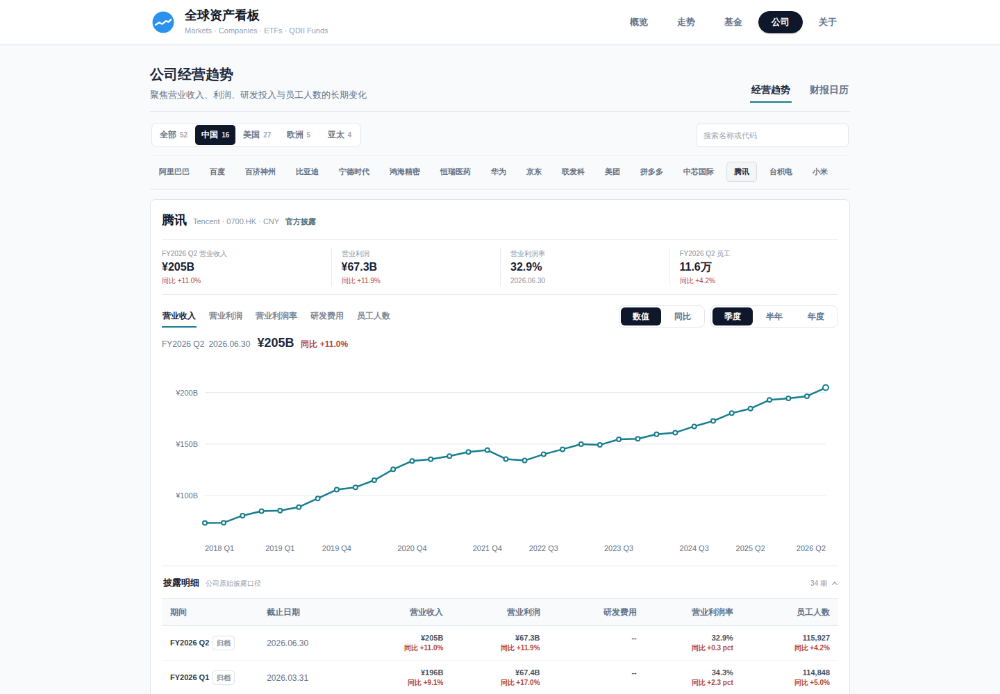

# 全球资产看板

[](https://github.com/taifuer/fund_valuation/actions/workflows/ci.yml)

聚合全球主要指数、资产、ETF、代表性公司与 QDII 主动基金公开数据，提供市场概览、区间表现、经营趋势和按目标日期对齐的基金估算净值。

[在线访问](https://fund.taifua.com/) · [数据与估算](./docs/DATA.md) · [部署运维](./docs/OPERATIONS.md)

## 核心能力

- **全球市场**：覆盖 A 股、美股、港股及日韩台主要指数，现货闭市时可按规则展示活跃期货参考行情
- **收益与风险**：按资产类型和区间查看收益、回撤、收益回撤比与胜率，并支持表头排序
- **QDII 基金**：展示官方净值、待公布估值和实时参考，支持持仓穿透、净值明细与历史走势
- **公司趋势**：以版本化离线数据呈现 52 家代表企业的营收、利润、研发投入和员工人数变化，并收录逐期来源与官方财报日程
- **本地数据层**：Flask API 只读取 SQLite 快照，独立 worker 负责抓取、校验、持久化与定期维护

## 技术架构

React 18 + TypeScript + Vite 6 · Flask + SQLite · Nginx + Gunicorn + Docker Compose

```text
浏览器 -> Vite / Nginx -> Flask API -> SQLite 快照与历史数据
                                        ^
独立 worker -> 公开数据源 ----------------+
```

页面请求不直接等待上游接口；公开数据源短暂异常时继续使用最近一次有效快照。详细设计见 [架构说明](./docs/ARCHITECTURE.md)。

## 快速开始

```bash
git clone https://github.com/taifuer/fund_valuation.git
cd fund_valuation
npm install
npm run backend:setup
```

分别启动后端、worker 和前端：

```bash
npm run backend
npm run backend:worker
npm run dev
```

首次运行可执行 `npm run backend:backfill` 初始化历史数据，随后访问 `http://localhost:5173`。Docker 部署、环境变量、备份与数据库维护见 [部署运维](./docs/OPERATIONS.md)。

## 演示

### 首页


### 收益


### 公司



更多界面：[基金](./demo/fund.png) · [风险](./demo/risk.png) · [股票走势](./demo/stock_history.png) · [基金详情](./demo/fund_detail.png) · [基金走势](./demo/fund_history.png) · [基金净值](./demo/fund_value.png)

## 文档

- [架构说明](./docs/ARCHITECTURE.md)：运行时拓扑、刷新策略、模块边界与状态接口
- [数据与估算](./docs/DATA.md)：数据来源、估算公式、公司数据口径与已知局限
- [公司数据维护](./docs/COMPANY_DATA.md)：离线财报数据、候选生成、审阅流程与财报日历来源
- [部署运维](./docs/OPERATIONS.md)：本地开发、Docker、回填、备份、数据库维护与测试
- [项目复盘](./docs/PROJECT_RETROSPECTIVE.md)：从 QDII 估值工具演进为全球资产看板的决策与经验

## 免责声明

数据来自公开接口及公司披露，可能存在延迟、缺失或误差；估算结果仅供参考，不构成投资建议，基金净值以基金管理人正式披露为准。

## License

MIT
